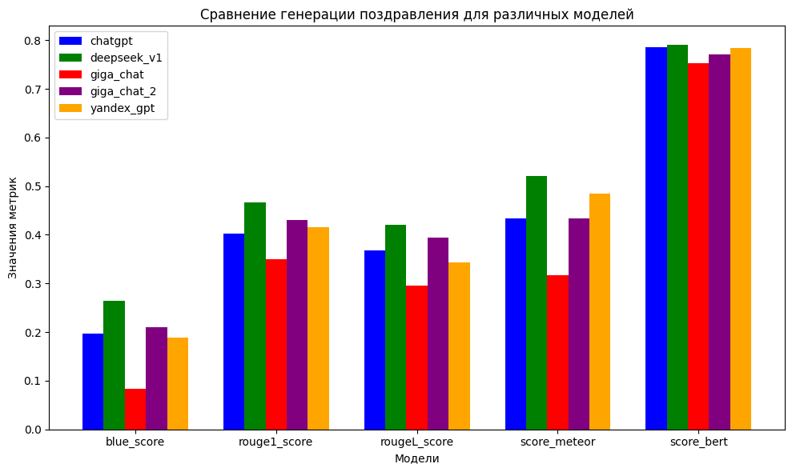

# ✨ Оценка качества сгенерированных поздравлений ✨


## Обзор

Проект представляет собой исследование метрик для оценки качества текстов поздравлений, сгенерированных различными языковыми моделями. В рамках исследования были рассмотрены такие метрики, как:

- ✨ BLEU
- ✨ ROUGE
- ✨ METEOR
- ✨ BERTScore

Было сопоставлено качество генераций моделей:

- ChatGPT
- GigaChat
- GigaChat2
- DeepSeek-V1
- YandexGPT

Генерации DeepSeek-R1 считались эталонными.


## Результаты

Выводы и график с результатами:



## 🛠️ Установка

```bash
pip install nltk rouge-score evaluate matplotlib numpy
```

### BLUE

BLUE (Bilingual Evaluation Understudy) - это метрика, которая используется для оценки качества машинного перевода. Она вычисляется как:

$$
\text{BLUE} = \exp\left(\min(0, 1 - \frac{r}{c})\right) \cdot \left(\prod_{n=1}^{N}\text{precision}_n\right)^{1/N}
$$

где:
- $r$ — количество слов в переводе,
- $c$ — количество слов в эталонном тексте,
- $\text{precision}_n$ — точность на уровне n-грамм.

### ROUGE

ROUGE (Recall-Oriented Understudy for Gisting Evaluation) - это набор метрик, используемых для оценки качества текстовых резюме и машинного перевода. Основная идея заключается в сравнении автоматически сгенерированного текста с эталонным текстом.

- **ROUGE-N**: Оценивает совпадение n-грамм между двумя текстами. Например, ROUGE-1 оценивает однословные совпадения, а ROUGE-2 - двухсловные совпадения.
- **ROUGE-L**: Основан на длине наибольшего общего подсписка (LCS).
- **ROUGE-S**: Основан на skip-bigrams.

Формулы для каждой из этих метрик выглядят следующим образом:

**ROUGE-N:**

$$ \text{ROUGE-N} = \frac{\sum_{S \in \text{RS}} \sum_{\text{n-gram} \in S} \text{Count}_{\text{match}}(\text{n-gram})}{\sum_{S \in \text{RS}} \sum_{\text{n-gram} \in S} \text{Count}(\text{n-gram})} $$

где RS - множество эталонных текстов, Count_match(n-gram) - количество совпадающих n-грамм между автоматически сгенерированным текстом и эталоном, а Count(n-gram) - общее количество n-грамм в эталоне.

**ROUGE-L:**

$$ \text{ROUGE-L} = \frac{(1 + \beta^2) \cdot P_r \cdot R_r}{R_r + \beta^2 \cdot P_r} $$

где $P_r$ - точность (precision), $R_r$ - полнота (recall), $\beta$ - коэффициент, который контролирует баланс между точностью и полнотой.

**ROUGE-S:**

$$ \text{ROUGE-S} = \frac{\sum_{S \in \text{RS}} \sum_{\text{skipped bigram} \in S} \text{Count}_{\text{match}}(\text{skipped bigram})}{\sum_{S \in \text{RS}} \sum_{\text{skipped bigram} \in S} \text{Count}(\text{skipped bigram})} $$

где skipped bigram - это пара слов, которые могут быть разделены другими словами, но все еще считаются связанными.

### METEOR

$$ \text{METEOR} = F_{\text{mean}} \cdot (1 - \gamma \cdot p)^\beta $$

где:
- $F_{\text{mean}}$ — среднее гармоническое между точностью и полнотой.
- $\gamma$ — коэффициент, определяющий важность точности по сравнению с полнотой.
- $p$ — доля лишних слов в ответе.
- $\beta$ — параметр, регулирующий влияние доли лишних слов на итоговую оценку.

**Описание:**

Метрика **METEOR** (Metric for Evaluation of Translation with Explicit ORdering) используется для оценки качества машинного перевода. Она учитывает не только точность и полноту ответа, но также его структуру и порядок слов. Формула включает три основных компонента:

1. **Среднее гармоническое между точностью и полнотой ($F_{\text{mean}}$):**
   Это стандартная мера, которая сочетает в себе точность (доля правильных слов среди всех предсказанных) и полноту (доля правильных слов среди всех ожидаемых).
   
2. **Коэффициент важности точности ($\gamma$):**
   Этот параметр позволяет регулировать вес точности относительно полноты. Обычно он устанавливается равным 0.5, что означает одинаковую важность обоих показателей.

3. **Доля лишних слов в ответе ($p$):**
   Эта величина показывает, насколько ответ перегружен лишними словами, которые не присутствуют в эталонном тексте.

4. **Параметр влияния доли лишних слов ($\beta$):**
   Этот параметр регулирует степень воздействия доли лишних слов на итоговый результат. Чем больше значение $\beta$, тем сильнее влияние лишних слов на снижение оценки.

Таким образом, формула **METEOR** позволяет учитывать как качество перевода, так и его структурную близость к оригиналу, что делает её более точной и полезной для оценки результатов машинного обучения.

### BERTScore
BERTScore - это метрика оценки качества перевода или генерации текста на основе модели BERT. Она использует контекстные представления слов из модели BERT для сравнения двух текстов. Метрика учитывает как точность (precision), так и полноту (recall) при оценке совпадений между двумя текстами.

Формула для вычисления BERTScore выглядит следующим образом:

$$
\text{BERTScore} = \frac{\sum_{i=1}^{n} \text{IDF}(w_i) * \text{Precision}(w_i) * \text{Recall}(w_i)}{\sum_{i=1}^{n} \text{IDF}(w_i)}
$$

где:
- $w_i$ - i-й токен,
- $\text{IDF}(w_i)$ - обратная частота документа для токена $w_i$,
- $\text{Precision}(w_i)$ - точность для токена $w_i$,
- $\text{Recall}(w_i)$ - полнота для токена $w_i$.

Точность и полнота определяются как:

$$
\text{Precision}(w_i) = \frac{\text{CosSim}(\mathbf{h}_{w_i}, \mathbf{r}_j)}{\max_k(\text{CosSim}(\mathbf{h}_{w_i}, \mathbf{r}_k))}
$$

$$
\text{Recall}(w_i) = \frac{\text{CosSim}(\mathbf{h}_{w_i}, \mathbf{r}_j)}{\max_l(\text{CosSim}(\mathbf{h}_{w_l}, \mathbf{r}_j))}
$$

где:
- $\mathbf{h}_{w_i}$ - представление слова $w_i$ в гипотезе,
- $\mathbf{r}_j$ - представление слова $r_j$ в референсе,
- $\text{CosSim}$ - косинусное сходство между векторами представлений слов.

Таким образом, BERTScore оценивает качество перевода или генерации текста, учитывая семантическое соответствие между словами в контексте обоих текстов.


## 🌟 Обратная связь

👉 Если у вас есть идеи, как улучшить проект, оставьте их в issues или сделайте pull request!

